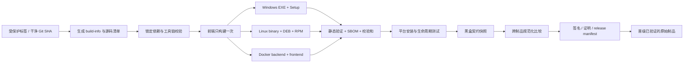

# v1.0.6 交付制品等价性与发布阻断门禁实施计划

> **状态**：已规划，待实施<br>
> **创建日期**：2026-08-28<br>
> **目标候选版本**：产品版本 v1.0.6<br>
> **升级基线**：正式标签 `v1.0.5`，提交 `29c6f6f68ab35e25f8cf7237ee187de359c77714`<br>
> **规划基线**：`dev@86d8589a0b376057fbd1570616dcef6c49aefbb3`<br>
> **适用制品**：Windows 单文件 EXE、Inno Setup 安装包、DEB、RPM、Docker backend/frontend 镜像组合<br>
> **预计工作量**：11～15 个工程日，另加一次完整 RC 演练<br>
> **执行原则**：同一源码、一次构建、不可变晋级、证据闭环、失败关闭（fail-closed）

## 0. 执行裁决

当前发布流程不能证明四类交付物行为等价，也不能证明安装生命周期幂等。v1.0.6 在本计划的全部非豁免门禁通过前不得发布。

本计划作出以下强制裁决：

1. 发布候选必须来自一个干净、不可变的 Git 提交；所有制品嵌入同一 `git_sha`。
2. 前端只允许构建一次，生成的同一份 `frontend/dist` 注入 EXE、DEB、RPM 和 Docker 前端镜像。
3. Python 公共运行依赖必须来自同一锁定集合；平台专用依赖只能通过显式白名单增加，不能覆盖公共依赖版本。
4. 正式发布只能晋级已经完成验证的原始制品；门禁后禁止重新构建再发布。
5. `latest` 只允许作为本地便利标签，不能作为发布清单、远程部署或回滚依据。
6. 测试失败、制品缺失、证据缺失和 CI 基础设施不确定均视为阻断，不允许默认为通过。
7. Windows、DEB、RPM、Docker 的平台差异必须登记为“允许差异”；未登记差异一律按等价性失败处理。

## 1. 背景与已确认风险

| 编号 | 已确认事实 | 风险 | 本计划门禁 |
|---|---|---|---|
| R1 | 现有 `dist/btdeck.exe` 可启动，但内嵌前端哈希与当前 `frontend/dist` 不同 | 同一版本号对应不同功能 | G1、G5 |
| R2 | Docker/源码回归使用 `qbittorrent-api~=2025.2.0`，Windows/Linux 打包依赖使用 `~=2025.5.0` | 下载器行为可能跨制品漂移 | G2 |
| R3 | CI 仅覆盖 Ubuntu + Python 3.12、Node 20 | Python 3.11 Docker、Windows 和安装脚本缺少回归 | G2、G3 |
| R4 | Inno Setup 缺失、fpm 缺失时构建脚本会告警并继续 | 流水线“绿色”但制品不完整 | G4 |
| R5 | DEB 只有一次旧版首次安装证据；RPM 没有安装运行证据 | Linux 生命周期未知 | G6、G7 |
| R6 | Docker 使用两个独立 `latest` 镜像 | 前后端可混装不同提交 | G1、G10 |
| R7 | `verify-package.py` 主要检查前端入口和资源目录是否存在 | 无法发现内容陈旧、版本错位、缺后端资源 | G5 |
| R8 | Docker Nginx 与 PyInstaller/FastAPI 静态托管在上传限制、缓存、压缩和超时上不同 | 边界请求行为并非天然一致 | G8、允许差异清单 |
| R9 | 历史上 Python 3.12 回归未发现 Python 3.11 镜像启动语法错误 | 目标运行时必须直接参与门禁 | G3、G7 |
| R10 | Linux 二进制曾在 Debian 12 构建，依赖 glibc 2.36 | Rocky Linux 9 glibc 2.34 可能不能运行 | G2、G6 |
| R11 | Linux `before-remove` 无条件停止并禁用服务 | RPM/DEB 升级后服务状态可能错误 | G6 |
| R12 | EXE、包元数据、镜像标签和健康接口没有完整 Git SHA 证据链 | 无法把运行实例追溯到源码 | G1、G10 |

## 2. 范围、术语与不变量

### 2.1 本计划范围

| 交付形态 | 被认证对象 | 目标环境 | 入口 |
|---|---|---|---|
| Windows 免安装版 | `btdeck.exe` | Windows Server/Windows 11 x64 | `app/desktop_main.py` |
| Windows 安装版 | Inno Setup `setup.exe` 内嵌的同一 `btdeck.exe` | Windows Server/Windows 11 x64 | NSSM 服务与桌面入口 |
| DEB | `.deb` 内的 Linux PyInstaller 二进制 | Debian 12 x64 | systemd 服务 |
| RPM | `.rpm` 内的同一 Linux PyInstaller 二进制 | Rocky Linux 9 x64 | systemd 服务 |
| Docker | backend + frontend 两个镜像的不可变组合 | Docker Engine + Compose | `btdeck_startup.sh` + Nginx |

Android APK、静态展示 Demo、远程 Unraid 实际部署不纳入本轮等价性认证；它们可以复用制品溯源机制，但不能拖延本门禁落地。

### 2.2 “核心功能等价”的定义

四种形态同时满足以下条件才可判定核心功能等价：

1. `product_version`、`git_sha`、Alembic head、后端源码清单和前端资源清单一致。
2. 公共 Python 运行依赖的包名和解析版本一致；仅允许登记后的平台依赖差异。
3. 相同初始数据和请求序列产生相同的 HTTP 状态、CommonResponse `code`、业务字段和数据库最终状态。
4. OpenAPI 路径、方法、请求/响应 schema 摘要一致。
5. 数据库首次迁移、再次启动和从 v1.0.5 升级后的 head 与关键数据一致。
6. SPA 路由和静态资源内容一致；托管层响应头差异按允许差异清单单独验证。

时间戳、随机 ID、绝对路径、端口、主机名、平台路径分隔符等非业务字段由规范化器处理后再比较，不能直接忽略整段响应。

### 2.3 “安装生命周期幂等”的定义

同一个候选制品连续执行以下操作后，服务、配置和数据状态必须稳定：

1. 首次安装成功。
2. 同版本再次安装/覆盖安装成功，不生成重复服务、重复用户、重复任务或新密钥。
3. 连续启动、停止、重启两次，最终只有一个服务实例且端口唯一。
4. 从 v1.0.5 升级到 v1.0.6 后配置、用户数据和数据库保留，Alembic 只有一个 head。
5. 卸载后服务和程序文件移除；用户数据默认保留，除非用户显式执行 purge。
6. Docker 对同一镜像重复 `compose up -d`、容器 recreate 和主机重启后，卷数据与密钥保持不变。

### 2.4 允许差异清单

| 差异 | 允许范围 | 必须验证 |
|---|---|---|
| Windows 桌面伴侣/pywebview | Windows 可额外提供 GUI 和伴侣模式 | 无 GUI/服务会话仍可启动核心服务；GUI 不改变 API 语义 |
| NSSM 与 systemd | 服务管理器命令和日志位置不同 | 单实例、自动启动、停止和卸载结果一致 |
| Nginx 与 FastAPI 静态托管 | gzip、缓存头、代理超时可不同 | API body 上限、安全头、SPA fallback 形成明确契约 |
| 配置/数据目录 | 路径按平台不同 | 权限、持久化、升级保留与健康检查一致 |
| 平台专用依赖 | Windows 可多 `pywebview/pythonnet`，Linux 可多打包工具 | 公共运行依赖版本不能漂移 |

新增允许差异必须修改版本化清单、增加独立测试并由发布负责人批准；不能在失败后临时扩大忽略规则。

## 3. 目标证据链



每个候选版本必须产出：

- `build-info.json`：嵌入每个运行制品。
- `source-manifest.json`：与运行时有关的跟踪文件路径和 SHA256。
- `frontend-asset-manifest.json`：唯一前端构建的文件路径、大小和 SHA256。
- `dependency-manifest-<artifact>.json`：各制品实际解析依赖。
- `sbom-<artifact>.cdx.json`：CycloneDX SBOM。
- `checksums.txt`：所有发布文件 SHA256。
- `contract-snapshot-<artifact>.json`：规范化黑盒结果。
- `lifecycle-report-<artifact>.json`：安装、升级、重启、卸载结果。
- `gate-report.json`：各门禁 PASS/FAIL/INDETERMINATE、证据路径和耗时。
- `release-manifest.json`：制品名称、digest、签名、组合关系与全部证据索引。

## 4. 统一版本与构建元数据

### 4.1 单一版本输入

新增发布配置作为唯一产品版本输入，其他位置由脚本生成或校验：

- 产品版本：`1.0.6`。
- Git 标签：`v1.0.6`。
- 升级基线：`v1.0.5`。
- 内部 feature ID 不再被构建脚本当作产品版本。

G1 必须检查以下位置一致：

- `backend/app/version.py`。
- `frontend/package.json`。
- `feature_list.json.release_version`。
- `deploy/btdeck.iss`。
- DEB/RPM metadata。
- Docker OCI label。
- `/health/live` 与 `/health/ready`。
- `release-manifest.json`。

### 4.2 `build-info.json` 最小字段

```json
{
  "schema_version": 1,
  "product_version": "1.0.6",
  "git_sha": "40位完整SHA",
  "git_tag": "v1.0.6",
  "source_date_epoch": 0,
  "build_id": "CI run id / attempt",
  "artifact_kind": "windows-exe|windows-setup|linux-deb|linux-rpm|docker-backend|docker-frontend",
  "target_os": "windows|linux",
  "target_arch": "amd64",
  "python_version": "仅后端制品",
  "node_version": "仅前端构建",
  "alembic_head": "revision",
  "frontend_manifest_sha256": "sha256",
  "dependency_manifest_sha256": "sha256",
  "dirty": false
}
```

健康接口在保持 CommonResponse 外壳不变的前提下增加 `build` 字段；不得移除现有 `data.status` 和 `data.version`，避免破坏桌面/Android 伴侣兼容性。

### 4.3 平台元数据

- Windows EXE 写入 FileVersion、ProductVersion、ProductName 和完整 SHA 的备注字段。
- Inno Setup 的版本、内嵌 EXE SHA 和 release manifest 一致。
- DEB/RPM 写入产品版本、架构和构建 SHA；包内 `/opt/btdeck/build-info.json` 与二进制一致。
- Docker backend/frontend 写入 `org.opencontainers.image.version`、`revision`、`created`、`source`，Compose 通过 digest 组合。
- 所有正式文件名包含产品版本和架构，不使用 `latest` 作为唯一标识。

## 5. 工具链与依赖一致性方案

### 5.1 统一工具链

1. 后端目标运行时统一为 Python 3.11；精确 patch 版本在实施时锁定并写入发布配置。
2. 前端构建统一迁移到一个仍受支持的 Node LTS；首批以 Node 22 做兼容验证，通过后固定精确版本。
3. CI、本地发布脚本和 Dockerfile 都从同一工具链配置读取版本。
4. Docker base image 必须固定 digest；GitHub Actions 和第三方工具必须固定不可变版本或 commit SHA。
5. Linux 二进制在不高于 glibc 2.31 的基线环境构建，并在 Debian 12、Rocky Linux 9 直接运行验证；若单二进制无法兼容，必须显式拆成 distro-specific 制品，不能沿用同一文件名假装通用。

### 5.2 Python 依赖

目标结构：

- 公共运行依赖只有一个直接依赖源和一个带哈希锁文件。
- Docker、源码回归、Windows 包和 Linux 包共同安装公共锁文件。
- Windows/Linux requirements 仅声明 PyInstaller、pywebview 等平台专用增量依赖。
- 增加依赖等价检查器，至少比较 FastAPI、Starlette、Pydantic、SQLAlchemy、Alembic、qbittorrent-api、Transmission 客户端和加密库。
- 每个制品在构建后从真实环境导出依赖清单，而不是只比较 requirements 文本。

`qbittorrent-api` 版本分叉必须在 W1 关闭：统一到生产已验证版本，或完成新版兼容回归后统一升级；不允许 Docker 和安装包继续解析不同版本。

### 5.3 前端依赖

- `package-lock.json` 是唯一依赖解析输入，所有构建使用 `npm ci`。
- `package.json` 增加 `engines` 与 package manager 版本约束。
- 正式流水线先生成唯一 `frontend-dist` 制品，后续任务只消费，不再各自执行 `npm run build`。
- `frontend-asset-manifest.json` 必须在四种交付物中一致。

## 6. 制品输出契约

候选版本的发布集合至少包含：

| 类别 | 文件/引用 | 强制关系 |
|---|---|---|
| Windows | `BtDeck-v1.0.6-windows-amd64.exe` | 独立 EXE |
| Windows | `BtDeck-Setup-v1.0.6-windows-amd64.exe` | 安装后的主 EXE SHA 必须等于独立 EXE |
| Linux | `BtDeck-v1.0.6-linux-amd64` | DEB/RPM 共用的中间二进制，不一定公开发布 |
| DEB | `BtDeck-v1.0.6-linux-amd64.deb` | 解包后二进制 SHA 等于 Linux 中间二进制 |
| RPM | `BtDeck-v1.0.6-linux-amd64.rpm` | 解包后二进制 SHA 等于 Linux 中间二进制 |
| Docker | `btdeck-backend@sha256:...` | manifest 记录 digest，不以 `latest` 配对 |
| Docker | `btdeck-frontend@sha256:...` | 与 backend 同一 SHA 和前端 manifest |
| 证据 | `release-manifest.json`、`checksums.txt`、SBOM、门禁报告 | 缺一即阻断 |

构建脚本增加严格发布模式，例如 `--release --require-all`。严格模式下缺少 Inno Setup、fpm、签名工具、前端预构建产物或元数据时必须非零退出；当前“告警后跳过”只允许保留在开发模式。

## 7. 发布阻断门禁总表

门禁状态只有四种：`PASS`、`FAIL`、`INDETERMINATE`、`NOT_RUN`。只有全部非豁免门禁为 `PASS` 才能晋级。

| 门禁 | 级别 | 核心检查 | 主要证据 | 失败处理 |
|---|---|---|---|---|
| G0 候选冻结 | P0 | 受保护标签、干净 SHA、升级基线存在 | Git 元数据 | 阻断 |
| G1 版本与溯源 | P0 | 所有版本字段、SHA、资源清单一致 | build-info/source manifest | 阻断，不可豁免 |
| G2 工具链与依赖 | P0 | 锁文件、公共依赖一致、glibc 兼容 | dependency manifest | 阻断，不可豁免 |
| G3 源码回归 | P0 | 后端、前端、迁移、目标运行时测试 | JUnit/coverage/build log | 阻断 |
| G4 制品完整构建 | P0 | 六个认证对象全部生成 | artifact inventory | 阻断，不可豁免 |
| G5 制品静态等价 | P0 | 内嵌资源、前端 manifest、迁移、配置排除 | verifier report | 阻断 |
| G6 安装生命周期 | P0 | 首装/重装/升级/重启/卸载/数据保留 | lifecycle reports | 阻断 |
| G7 运行与迁移 | P0 | live/ready、单实例、迁移 head、重启稳定 | runtime reports | 阻断 |
| G8 黑盒功能等价 | P0 | API、数据库、SPA 规范化快照一致 | contract snapshots/diff | 阻断 |
| G9 安全与供应链 | P0/P1 | SBOM、漏洞、秘密、签名、许可证 | scan/sign reports | 按策略阻断 |
| G10 证据闭环与晋级 | P0 | manifest 完整、digest 未变化、审批完成 | gate-report/attestation | 阻断，不可豁免 |

### G0：候选冻结

- 候选必须由 `v1.0.6` 受保护标签触发。
- 标签提交必须通过 PR 源码回归，构建环境检出后 `git diff --exit-code`。
- `v1.0.5` 标签存在并解析到记录的 baseline SHA。
- 发布流水线不能从开发者工作区、未跟踪 `dist/` 或旧 tar 取制品。

### G1：版本与溯源

- 所有版本入口完全一致。
- 每个运行实例的健康接口返回同一完整 Git SHA、版本、Alembic head 和前端 manifest SHA。
- Windows 属性、DEB/RPM metadata、OCI labels 与包内 build-info 一致。
- `dirty=true`、短 SHA、未知 SHA、版本占位符均直接失败。

### G2：工具链与依赖

- 公共依赖逐包逐版本一致，平台增量差异全部命中白名单。
- `qbittorrent-api` 不得分叉。
- Python/Node/打包器/Inno/fpm 的精确版本写入 manifest。
- Docker base image 固定 digest。
- Linux 二进制在 Debian 12 和 Rocky Linux 9 均通过动态链接与启动测试。
- 锁文件变更必须伴随依赖差异报告和安全扫描。

### G3：源码回归

必须执行：

- 后端架构检查、Black、Flake8、Mypy、全量 pytest 和覆盖率门禁。
- Python 3.11 必跑；Python 3.12 可作为兼容矩阵保留，但不能替代 3.11。
- 前端 typecheck、Jest coverage、lint、生产构建。
- Alembic 单 head、空库 upgrade、v1.0.5 数据库 upgrade、失败启动 fail-fast。
- 打包契约测试必须包含负向变异样例，证明缺资源、版本漂移、依赖漂移会报红。

### G4：制品完整构建

- EXE、Setup、DEB、RPM、Docker backend、Docker frontend 全部存在且非空。
- Inno/fpm 缺失或失败必须令 release job 失败。
- 构建日志记录工具链和依赖解析；敏感环境变量必须脱敏。
- 每个制品生成 SHA256、SBOM 和 build-info。
- 构建任务完成后上传不可变 CI artifact，后续门禁只下载这些制品。

### G5：制品静态等价

增强验证器，至少验证：

1. PyInstaller archive 内嵌 build-info、Alembic、契约 JSON、schema snapshot 和完整前端 manifest。
2. EXE 与 Setup 内主 EXE SHA 一致。
3. DEB、RPM 与 Linux 中间二进制 SHA 一致。
4. 四种形态的 `frontend-asset-manifest.json` 完全一致。
5. source manifest、Alembic head、公共依赖 manifest 一致。
6. 包内不得出现 `config.yaml`、`.env`、`app.db`、真实密钥、测试缓存或构建机绝对路径。
7. Docker backend/frontend 的 label 和 build-info 同源。

验证器自身必须有正向与负向测试，至少对“替换旧 index”“删除契约 JSON”“改变 qB 版本”“混入 app.db”“修改 SHA”五种变异报红。

### G6：安装生命周期

#### Windows 免安装 EXE

- 隔离配置目录启动两次，第二次不重置 secret、不重复迁移、不残留额外进程。
- 停止后端口释放；再次启动 live/ready 通过。
- 无桌面会话下服务端模式可运行；桌面 GUI 作为独立平台测试。

#### Windows Setup

- 静默首次安装、同版本覆盖安装、从 v1.0.5 升级、服务重启、静默卸载。
- 服务名、启动类型、可执行路径和端口唯一。
- 同版本安装不重复创建 NSSM 服务和快捷方式。
- 升级后 secret、配置、用户、数据库和审计数据保留。
- 卸载后 NSSM 服务和程序文件移除；数据默认保留。

#### DEB 与 RPM

- 在各自目标系统执行首次安装、同版本 reinstall、从 v1.0.5 upgrade、服务重启、remove。
- 安装后用户、目录、权限、env 文件和 systemd unit 正确。
- 同版本重装不得重置 `SECRET_KEY`。
- 升级脚本必须按包管理器参数区分 upgrade/remove，最终服务 enabled + active。
- remove 后服务/unit 消失或失效，数据目录保留；显式 purge 行为另行测试。

#### Docker Compose

- 重复 `compose up -d`、restart、force-recreate 和加载同一 digest 后状态稳定。
- backend/frontend digest 固定组合，卷内配置、secret 和数据库不变。
- 从 v1.0.5 digest 组合升级后数据保留、迁移成功、健康检查通过。

### G7：运行与迁移

每个制品至少验证：

- `/health/live`、`/health/ready` 和首页可达。
- readiness 中 database、worker、event loop 检查通过。
- 第一次启动完成全部 Alembic migration；第二次启动无新 DDL。
- v1.0.5 数据库升级后单 head、核心表行数和认证数据保持。
- 端口冲突时 fail-fast，不得连接到其他 BtDeck/非 BtDeck 实例并误判就绪。
- 进程停止后无孤儿子进程；服务管理器状态与实际进程一致。

### G8：跨制品黑盒功能等价

采用同一套外部测试器对每个运行实例执行固定场景，测试器不能 import `app.*`，避免绕过真实制品：

| 场景 | 核心断言 |
|---|---|
| C01 健康与构建身份 | version/SHA/head/frontend manifest 一致 |
| C02 OpenAPI 契约 | 路径、方法、schema 摘要一致 |
| C03 初始化与认证 | 首次初始化、登录、刷新、退出、错误码一致 |
| C04 用户与设置 | 读写后返回值及重启持久化一致 |
| C05 下载器管理 | 通过受控 qB/Transmission stub 完成新增、测试、编辑、删除 |
| C06 种子核心查询 | 固定 stub 数据下列表、状态、Tracker、分页结果一致 |
| C07 查询模板 | 新建、应用、更新、删除及高级条件语义一致 |
| C08 定时任务 | 列表、启停、立即执行的结果和审计一致 |
| C09 通知与审计 | 关键操作产生的通知、审计类型与分页格式一致 |
| C10 迁移与重启 | 重启前后数据、secret、migration head 一致 |
| C11 SPA | index、路由 fallback、资源 manifest 和关键 chunk 一致 |
| C12 文件路径边界 | 各平台映射后的授权/拒绝语义一致，路径文本规范化比较 |

每个场景输出规范化 JSON。聚合任务以一个明确基准快照比较其余制品；任何字段差异必须命中版本化允许差异规则。禁止使用宽泛的“删除整个 data”“忽略所有 msg”等规则。

### G9：安全与供应链

- 对源码、PyInstaller 内容、DEB/RPM 文件系统和 Docker 镜像生成 CycloneDX SBOM。
- 扫描操作系统包、Python 包、NPM 生产依赖和秘密。
- Critical 漏洞、真实秘密、禁用许可证：不可豁免阻断。
- High 漏洞默认阻断；只有不可利用证明、责任人、补救版本和不超过 30 天的到期日齐全时可申请例外。
- Windows 正式制品执行 Authenticode；Docker manifest/attestation 使用组织批准的签名机制。证书和密钥属于外部前置条件，不写入仓库。
- 签名前后的文件 digest 分别记录；发布清单引用最终签名制品。

### G10：证据闭环与晋级

- `gate-report.json` 中 G0～G10 全部有状态、开始/结束时间、证据 digest 和日志链接。
- 所有正式制品 digest 与完成测试时完全一致。
- Docker Compose 发布模板引用 digest，不引用可变 tag。
- 发布负责人审批的是 release manifest，而不是单独文件名。
- 发布系统只复制/晋级已验证制品，不执行 rebuild。

## 8. CI 分层与任务依赖

### 8.1 PR 快速门禁

每个 PR 必跑：

1. 版本/依赖/打包脚本静态契约。
2. 后端 Python 3.11 全量回归与质量检查。
3. 前端统一 Node 版本下的 typecheck、lint、Jest、build。
4. `build-info`、manifest、验证器的单元与变异测试。
5. Dockerfile/Compose 语法和固定 digest 规则。

PR 门禁不宣称制品已认证，只保证实现没有破坏发布能力。

### 8.2 Nightly 门禁

每日或部署相关文件变更时执行：

- 全制品构建。
- 静态等价验证。
- EXE、DEB、RPM、Docker 首次安装/启动冒烟。
- 黑盒契约核心子集 C01～C06。
- SBOM 与漏洞扫描。

Nightly 失败不影响已发布版本，但阻止创建新的 RC。

### 8.3 RC/Tag 完整门禁

建议新增 `.github/workflows/release-gate.yml`，任务 DAG：

```text
preflight
  ├─ source-backend
  ├─ source-frontend
  └─ build-frontend-once
        ├─ build-windows
        ├─ build-linux
        └─ build-docker
              ↓
        static-verify-and-sbom
        ├─ lifecycle-windows
        ├─ lifecycle-deb
        ├─ lifecycle-rpm
        └─ lifecycle-docker
              ↓
        compare-contract-snapshots
              ↓
        sign-and-final-verify
              ↓
        approve-and-promote
```

Windows 生命周期使用 `windows-2022` Runner。DEB/RPM 优先使用带 systemd 的特权测试容器；W0 必须先证明托管 Runner 能稳定运行该拓扑。如果不可行，必须提供受控 self-hosted Linux Runner，状态保持 `INDETERMINATE` 并阻断，不得降级为只解包测试。

## 9. 升级基线策略

升级测试按以下优先级取得 v1.0.5：

1. 优先使用正式发布、带已知 digest/签名的 v1.0.5 制品。
2. 若正式制品不可得，可从标签 `v1.0.5@29c6f6f...` 重建“迁移夹具”。
3. 重建夹具必须标注 `reconstructed=true`，只能证明数据库/配置升级路径，不能冒充正式历史制品的安装器兼容性证据。
4. 无论来源，基线制品与数据库夹具都要生成 SHA256 并归档。
5. 迁移数据库至少包含：管理员与强制改密状态、下载器配置、种子记录、查询模板、定时任务、通知、审计、回收站和孤儿文件记录。

## 10. 计划中的文件与职责

最终名称可在 W0 小幅调整，但职责不得合并消失。

| 类型 | 计划文件 | 职责 |
|---|---|---|
| CI | `.github/workflows/release-gate.yml` | RC 全量门禁、证据汇聚和晋级 |
| CI | `.github/workflows/regression.yml` | 对齐 Python/Node 统一版本和快速静态门 |
| 发布配置 | `release/release-config.json` | 产品版本、基线、工具链、允许平台列表 |
| Schema | `release/schemas/build-info.schema.json` | build-info 校验 |
| Schema | `release/schemas/release-manifest.schema.json` | 发布清单校验 |
| 允许差异 | `release/equivalence-exceptions.json` | 有版本、责任人和到期日的差异规则 |
| 元数据 | `scripts/release/generate_build_info.py` | 生成 build-info/source/frontend manifest |
| 聚合验证 | `scripts/release/verify_release_bundle.py` | G1/G2/G4/G5/G10 总验证 |
| 黑盒测试 | `scripts/release/contract_runner.py` | 外部 API/SPA 场景执行与快照输出 |
| 快照比较 | `scripts/release/compare_snapshots.py` | 规范化跨制品比较 |
| 生命周期 | `scripts/release/lifecycle/` | Windows/DEB/RPM/Docker 场景驱动 |
| 测试夹具 | `scripts/release/fixtures/` | v1.0.5 DB、受控 qB/TR stub、路径夹具 |
| 后端 | `backend/app/core/build_info.py` | 读取嵌入元数据并供健康接口使用 |
| 后端 | `backend/app/api/endpoints/health.py` | 在兼容前提下暴露 build 身份 |
| 依赖 | `backend/requirements*.txt`、`deploy/requirements-*-package.txt` | 建立公共锁与平台增量依赖 |
| Windows | `deploy/build-windows.bat`、`btdeck-windows.spec`、`btdeck.iss` | 严格构建、嵌入元数据、版本资源、安装生命周期 |
| Linux | `deploy/build-linux.sh`、`btdeck.spec`、`btdeck.service` | 兼容构建、脚本参数语义、严格包输出 |
| Docker | `backend/Dockerfile`、`frontend/Dockerfile*`、`docker-compose.yml` | 固定 digest、元数据、不可变组合 |
| 验证器 | `deploy/verify-package.py` | 从“存在性检查”升级为内容与来源验证 |
| 测试 | `backend/tests/release/` | 元数据、依赖、manifest、变异、兼容测试 |
| 文档 | `docs/release/` | 本地复现、门禁处置、签名和发布 runbook |

## 11. 分阶段实施

### W0：基线固化与 CI 能力探针（1～2 日）

**工作项**：

1. 固化 v1.0.5 标签 SHA、当前候选 SHA、现有制品与依赖差异报告。
2. 证明 Windows Runner 能安装 Inno、启动 NSSM 服务并执行静默卸载。
3. 证明 Linux Runner 能启动 Debian 12/Rocky 9 systemd 测试容器。
4. 验证低 glibc 构建方案在两发行版运行；确定单 Linux 二进制或显式拆包方案。
5. 用 Node 22 跑前端全量测试/构建，锁定精确版本。
6. 确定正式 v1.0.5 制品是否可获得；否则生成 reconstructed 升级夹具。

**退出门**：环境能力报告完整；任何无法自动化的 P0 项都有 self-hosted 方案，而不是人工跳过。

### W1：版本、工具链、依赖与 build-info（2～3 日）

**工作项**：

1. 建立单一 release config 和版本一致性检查。
2. 统一 Python 公共锁文件，关闭 qB 版本漂移。
3. 固定 Python/Node/Docker base/tool versions。
4. 实现 build-info、source manifest、dependency manifest。
5. 健康接口兼容扩展 build 字段。
6. 补正向、负向和旧伴侣兼容测试。

**退出门**：G1、G2 在源码/模拟制品上通过；修改任意版本、SHA 或关键依赖会使测试失败。

### W2：一次前端构建与严格制品构建（2～3 日）

**工作项**：

1. 建立前端唯一构建任务和 asset manifest。
2. Windows/Linux/Docker 构建入口支持消费预构建前端。
3. release 模式缺工具/缺制品立即失败。
4. EXE/DEB/RPM/Docker 嵌入 build-info；Windows 生成版本资源。
5. Docker 输出 digest 组合，不再以两个 `latest` 作为发布输入。
6. 增强 verify-package 和 release bundle verifier。

**退出门**：G4、G5 通过；五类变异均能稳定拦截。

### W3：安装生命周期与迁移（3～4 日）

**工作项**：

1. Windows EXE/Setup 生命周期脚本。
2. DEB 生命周期脚本，覆盖 postinst/prerm 参数。
3. RPM 生命周期脚本，修复 upgrade/remove 时序。
4. Docker compose 重复部署和卷升级脚本。
5. 建立 v1.0.5 数据库/配置夹具与数据不变量比较。
6. 验证 secret、权限、服务和进程单实例。

**退出门**：G6、G7 全平台通过；同版本重复操作两次结果稳定。

### W4：黑盒契约与跨制品比较（2～3 日）

**工作项**：

1. 实现外部 contract runner 和最小 qB/TR stub。
2. 落地 C01～C12 场景、稳定夹具和字段规范化。
3. 建立允许差异 schema、过期检查和严格 diff。
4. 输出每制品快照及聚合对比报告。
5. 对漏比较、过宽忽略和错误基准做变异测试。

**退出门**：G8 通过；注入一个响应字段、路由或前端资源差异时聚合任务报红。

### W5：安全、签名、CI 编排与不可变晋级（2～3 日）

**工作项**：

1. 接入 SBOM、漏洞、秘密和许可证扫描。
2. 接入 Windows/Docker 签名；定义密钥不可用时的阻断状态。
3. 实现 release-gate DAG、artifact retention、gate report 汇聚。
4. 晋级任务只消费通过门禁的 digest。
5. 限制权限：构建只读源码，签名与发布使用独立环境和最小权限。

**退出门**：G9、G10 通过；篡改任一制品后最终校验失败。

### W6：RC 演练、文档和治理收口（1～2 日）

**工作项**：

1. 从 v1.0.5 完整演练 v1.0.6 RC。
2. 人为制造至少六类失败：旧前端、qB 漂移、缺契约 JSON、RPM 升级停服、Docker 混装、digest 篡改。
3. 验证每类失败均停在预期门禁，且未产生发布动作。
4. 完成发布、回滚、豁免、证书轮换和故障排查 runbook。
5. 更新 feature_list、progress、session-handoff 和 roadmap。

**退出门**：完整演练一次全绿，一次故障注入全阻断；证据包可由未参与实现者复核。

## 12. 失败、重试与豁免策略

### 12.1 失败关闭

- 测试断言失败：`FAIL`，禁止自动重跑掩盖。
- Runner、网络、registry、签名服务不可用：`INDETERMINATE`，仍阻断。
- 制品或报告缺失：`NOT_RUN` 或 `FAIL`，仍阻断。
- 仅允许对已判定为基础设施问题的 job 自动清理后重试一次；两次结果都写入 gate report。
- flaky 测试不能靠多次运行取一次绿色；P0 flaky 必须修复或隔离发布。

### 12.2 不可豁免项

以下项目不得人工放行：

- Git SHA/版本/制品 digest 不一致。
- 公共关键依赖版本漂移。
- 任一正式制品缺失或无法安装/启动。
- 数据库升级失败、数据丢失或 secret 重置。
- Critical 漏洞、真实秘密或签名/digest 校验失败。
- 跨制品核心 API/数据库结果不一致。

### 12.3 可申请的限时豁免

只允许对非核心响应头差异、无可利用性的 High 漏洞或明确的第三方基础设施限制申请。豁免记录必须包含：编号、范围、证据、风险接受人、补救任务、到期日（最长 30 天）和目标版本。到期检查失败自动阻断。

## 13. 测试数据与可重复性

1. 所有黑盒场景从同一数据快照启动，每个制品使用独立复制。
2. qB/TR stub 固定协议响应、延迟和错误注入，不访问真实生产下载器。
3. 时间由测试时钟或规范化器控制；随机值使用记录的 seed。
4. Windows/Linux 路径夹具表达同一逻辑目录，比较时转换为逻辑路径 ID。
5. 每轮测试记录数据库前后 SHA、表行数、Alembic head、secret 指纹和服务状态。
6. 失败现场上传日志和报告，但数据库、env、token、密码在上传前必须脱敏。

## 14. 发布判定与报告模板

最终结论只能是：

- `CERTIFIED`：G0～G10 全部满足政策，允许晋级。
- `REJECTED`：存在确定失败。
- `INDETERMINATE`：存在未运行、证据缺失或基础设施失败；不得发布。

发布摘要至少列出：

| 项目 | 内容 |
|---|---|
| 候选 | version、tag、完整 SHA、build id |
| 制品 | 文件名/digest/大小/签名状态 |
| 环境 | Windows、Debian、Rocky、Docker 版本 |
| 生命周期 | 首装、重装、升级、重启、卸载结果 |
| 等价性 | 12 个场景的快照摘要和差异数 |
| 安全 | SBOM、Critical/High、秘密、许可证 |
| 例外 | 有效豁免编号和到期日；无则写 none |
| 判定 | CERTIFIED/REJECTED/INDETERMINATE |

## 15. 风险与缓解

| 风险 | 缓解 |
|---|---|
| Windows GUI 自动化不稳定 | 核心门禁以服务/API 为主；GUI 保留小规模真实窗口 smoke，失败仍阻断 Windows GUI 声明 |
| systemd 特权容器在托管 Runner 不稳定 | W0 探针；失败则使用受控 self-hosted Runner，不降级 |
| v1.0.5 正式历史制品不可得 | 标签重建仅作为 migration fixture，并明确 reconstructed |
| 单 Linux 二进制跨 Debian/Rocky 不兼容 | 降低 glibc 构建基线；仍失败则拆分发行版制品和名称 |
| 黑盒场景过度依赖随机时间/ID | 固定 seed、规范化具体字段、禁止宽泛忽略 |
| 全门禁耗时过长 | PR/Nightly/RC 三层；RC 仍必须完整执行 |
| 签名证书未准备 | 作为外部前置条件提前跟踪；无证书时 G9=INDETERMINATE |
| 旧 Vue 工具链与 Node 22 不兼容 | W0 先做兼容探针；若失败立项修复，不让各打包方式继续使用不同 Node |

## 16. 完成定义

- [ ] release config 成为唯一产品版本入口，所有版本字段自动一致。
- [ ] Python 公共依赖锁定且四类后端制品解析版本一致，qB 分叉关闭。
- [ ] 前端只构建一次，所有制品内 asset manifest 完全一致。
- [ ] 所有制品嵌入并暴露同一完整 Git SHA 和 build-info。
- [ ] EXE、Setup、DEB、RPM、Docker 两镜像均由严格模式成功生成。
- [ ] G5 静态验证及至少五类变异测试通过。
- [ ] Windows、Debian、Rocky、Docker 生命周期矩阵全部通过。
- [ ] v1.0.5→v1.0.6 升级数据、secret 和迁移 head 保持正确。
- [ ] C01～C12 黑盒快照无未登记差异。
- [ ] SBOM、漏洞、秘密、许可证和签名策略通过。
- [ ] release manifest、gate report、checksums 与最终制品 digest 闭环。
- [ ] CI 证明失败/缺证据不会执行晋级。
- [ ] 完整 RC 演练与故障注入演练均有可复核证据。
- [ ] `./init.sh`、feature_list、progress、session-handoff、roadmap 和发布 runbook 更新。

## 17. 首个实施批次建议

第一批只实施 W0 + W1，不直接改复杂安装生命周期：

1. 固化 v1.0.5 baseline 和环境能力报告。
2. 新增 release config、build-info schema 与版本一致性测试。
3. 统一 `qbittorrent-api` 和公共依赖锁策略。
4. 将 CI 主测试运行时补到 Python 3.11。
5. 给健康接口增加向后兼容的 build 身份。
6. 用负向变异证明 SHA、版本、qB 版本漂移会阻断。

第一批完成后再进入制品构建改造，可把后续风险建立在可验证的身份和依赖基础上。

## 18. W0 执行结论（2026-08-28 实测）

> 证据根目录：`release/evidence/w0/`（含 w0-environment-report.md 与全部探针日志）；配置固化：`release/release-config.json`。

1. **基线**：v1.0.5 标签 = `29c6f6f…`（与计划一致）；候选规划基线 dev@433f729；`./init.sh --ci` 通过。
2. **升级基线制品**：GitHub Release API 对 v1.0.5 为 404；本地 `.release-build-v1.0.5/assets/` 有完整制品集（DEB/RPM/portable EXE+ZIP，SHA256 已归档）。来源对账：与 `git archive v1.0.5` 相比 971 文件仅 4 处差异（cleanup_executor.py 的 py3.11 f-string 热修即 R9 事故修复 + 3 个记录文件）。夹具策略改为 local-release-build（reconstructed 语义）；无 v1.0.5 Inno 安装器，Windows 升级生命周期测试范围相应受限并须在 G6 报告注明。
3. **R10 定案与治理**：现有 Debian 12 构建二进制在 Rocky 9 失败（libpython3.11.so.1.0 需 GLIBC_2.35 > 2.34）；python:3.11-bullseye 重建后**单二进制在 Debian 12 + Rocky 9 均完整启动** → §5.1.5 裁决为"单二进制 + bullseye 构建基线"，不拆发行版制品。
4. **Node 22 兼容**：Node v22.23.2 + npm 10.9.8 全量矩阵通过（contract:check/typecheck/84 套件 1233 测试/build）→ 前端构建统一锁定 22 线，§5.1.2 的 Node 22 验证完成。
5. **systemd 拓扑**：官方 rockylinux:9 / debian:12 基础镜像均不含 systemd；自建镜像配方（官方基 + 仓库安装 systemd；debian 必须补 `/sbin/init` 符号链接）在 `--privileged --cgroupns=host` 下双发行版单元生命周期全通；`is-system-running=degraded` 为容器正常态。
6. **CI 探针**：`.github/workflows/release-gate.yml` 已落地（4 个 W0 job、workflow_dispatch、fail-closed、报告 artifact 强制上传，复用本地已验证配方）；**尚未推送，CI 侧全部 NOT_RUN**——Windows Inno+NSSM 能力结论待推送后取得。
7. **移交**：未提交漂移 `advancedSearch.generated.ts` 已证实为合法再生成（contract:check 通过），G0 冻结前须提交；本机 Node/Python 工具链漂移由 W1 收口。

## 19. W1 执行结论（2026-08-29 实测）

> 证据根：`release/evidence/w1/`；任务 .1/.2/.3 已 done（feature_list 各 evidence）。

1. **CI 探针 4/4 全绿**：workflow 推送 dev 并在 master 注册（b357e07，仅注册用，dispatch ref=dev）；run 33236313405（Node22/bullseye/systemd 三绿）+ run 33237024759（Windows 绿，报告 artifact 归档 w0/）。两轮修复均证明 fail-closed 链路有效（artifact if-no-files-found: error 把跳步变成失败）：①runner 预装 Inno 6.7.1 与钉死 6.3.3 冲突→改预装探测；②pwsh7 无 `Set-Content -Append`→`Add-Content`。
2. **版本单一源落地**：release-config 1.0.6 为准，六处声明一致性强制（生成器 `--check-versions` + tests/release/test_version_consistency.py 13 例含 5 变异）。
3. **build-info 体系**：双 schema + 生成器（git SHA/alembic 单 head/双 manifest，真实仓库冒烟通过）+ 运行时读取器 + 健康接口 build 字段（外壳与旧字段不变；身份非法 ready 503 / live 200）；伴侣兼容由更新后的旧断言与新增回归共同锚定。
4. **依赖锁**：`backend/requirements-lock.txt`（51 包、全量哈希、Py3.11）落库，**qbittorrent-api==2025.2.0 分叉关闭**；打包 requirements 改为 `-r 锁 + 白名单增量`，手工拷贝面消除；干净容器 `--require-hashes --dry-run` 验证 OK。
5. **工具链统一**：Python 3.11（CI 主回归/Docker/锁）；Node 22.23.2（engines/packageManager/两 Dockerfile/CI）；四个基础镜像 digest 固化入 release-config 与 Dockerfile。
6. **镜像级 G2 首例闭环**：btdeck-backend:w1-smoke 构建成功（trixie deb822 镜像 sed 修复 + sdist wheel 哈希误杀改 pins 离线安装 + pip check），**真实环境 pip freeze 与锁归一化比对 50/50 全一致**；btdeck-frontend:w1-smoke 构建成功并配对冒烟（backend `/health/live` 携带 build 身份块 dev 模式返回）。
7. **遗留到 W2**：build-info 实际注入 EXE/DEB/RPM/Docker 制品、EXE 版本资源、严格 `--release --require-all` 模式、verify-package 内容级验证、五类静态变异。
